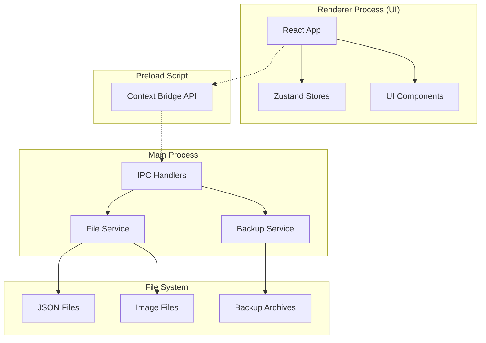

# Trading Journal App - System Architecture

## Overview

The Trading Journal App follows a secure Electron architecture with strict separation between main and renderer processes. Data is stored locally in JSON files with automatic backups.



## Directory Structure

```
trading-journal/
├── src/
│   ├── main/                    # Electron main process
│   │   ├── index.ts            # Entry point, window creation
│   │   ├── ipc/               # IPC communication
│   │   │   ├── handlers.ts    # IPC handler registration
│   │   │   ├── tradeHandlers.ts
│   │   │   └── thesisHandlers.ts
│   │   ├── services/          # Business logic
│   │   │   ├── FileService.ts
│   │   │   ├── BackupService.ts
│   │   │   ├── ExportService.ts
│   │   │   └── ImageService.ts
│   │   └── utils/             # Helper functions
│   │       ├── paths.ts       # Path management
│   │       └── validation.ts  # Data validation
│   │
│   ├── preload/               # Preload scripts
│   │   └── index.ts          # Context bridge setup
│   │
│   ├── renderer/              # React application
│   │   ├── src/
│   │   │   ├── components/    # UI components
│   │   │   │   ├── Layout/
│   │   │   │   ├── TradeForm/
│   │   │   │   ├── TradeList/
│   │   │   │   ├── Dashboard/
│   │   │   │   └── ui/       # shadcn components
│   │   │   ├── pages/        # Page components
│   │   │   │   ├── DashboardPage.tsx
│   │   │   │   ├── TradesPage.tsx
│   │   │   │   ├── ThesisPage.tsx
│   │   │   │   └── AnalyticsPage.tsx
│   │   │   ├── hooks/        # Custom React hooks
│   │   │   │   ├── useTrades.ts
│   │   │   │   ├── useThesis.ts
│   │   │   │   └── useDebounce.ts
│   │   │   ├── store/        # Zustand stores
│   │   │   │   ├── tradeStore.ts
│   │   │   │   ├── thesisStore.ts
│   │   │   │   └── uiStore.ts
│   │   │   ├── services/     # API calls to main
│   │   │   │   └── api.ts
│   │   │   ├── utils/        # Helper functions
│   │   │   ├── types/        # TypeScript types
│   │   │   │   └── electron.d.ts
│   │   │   ├── App.tsx       # Root component
│   │   │   └── main.tsx      # Entry point
│   │   └── index.html
│   │
│   └── shared/                # Shared between processes
│       ├── types/            # TypeScript interfaces
│       │   ├── trade.types.ts
│       │   ├── thesis.types.ts
│       │   └── index.ts
│       ├── constants/        # App constants
│       └── schemas/          # Zod validation schemas
│
├── data/                     # User data (gitignored)
│   ├── trades/              # Trade JSON files
│   │   └── 2025/
│   │       └── AAPL_20250124_uuid.json
│   ├── thesis/              # Thesis JSON files
│   ├── screenshots/         # Trade screenshots
│   └── backups/            # Automatic backups
│
├── tests/                   # Test files
│   ├── unit/
│   ├── integration/
│   └── e2e/
│
└── build/                   # Build configuration
    ├── electron-builder.yml
    └── icons/
```

## Data Flow Architecture

### 1. User Interaction Flow
```
User Action → React Component → Zustand Store → API Service → IPC → Main Process → File System
```

### 2. Data Loading Flow
```
App Start → Main Process → Read Files → IPC → Preload → React → Zustand → Components
```

## Core Components

### Main Process Components

#### FileService
**Responsibility**: Handle all file system operations
```typescript
interface FileService {
  // Trade operations
  saveTrade(trade: Trade): Promise<Trade>
  loadTrade(id: string): Promise<Trade>
  listTrades(filter?: TradeFilter): Promise<TradeSummary[]>
  deleteTrade(id: string): Promise<void>
  
  // Thesis operations
  saveThesis(thesis: Thesis): Promise<Thesis>
  loadThesis(id: string): Promise<Thesis>
  listThesis(): Promise<ThesisSummary[]>
  
  // Utility
  ensureDirectories(): Promise<void>
  validateDataIntegrity(): Promise<ValidationResult>
}
```

#### BackupService
**Responsibility**: Automated and manual backups
```typescript
interface BackupService {
  createBackup(): Promise<BackupInfo>
  restoreBackup(backupId: string): Promise<void>
  listBackups(): Promise<BackupInfo[]>
  scheduleAutoBackup(interval: number): void
  cleanOldBackups(daysToKeep: number): Promise<void>
}
```

### Renderer Process Components

#### Zustand Stores

**TradeStore**
```typescript
interface TradeStore {
  trades: Trade[]
  loading: boolean
  error: string | null
  
  // Actions
  loadTrades: () => Promise<void>
  addTrade: (trade: Partial<Trade>) => Promise<void>
  updateTrade: (id: string, updates: Partial<Trade>) => Promise<void>
  deleteTrade: (id: string) => Promise<void>
  
  // Filters
  filter: TradeFilter
  setFilter: (filter: Partial<TradeFilter>) => void
  
  // Optimistic updates
  optimisticUpdate: (id: string, updates: Partial<Trade>) => void
  revertOptimisticUpdate: (id: string) => void
}
```

**UIStore**
```typescript
interface UIStore {
  theme: 'light' | 'dark'
  sidebarCollapsed: boolean
  activeTradeId: string | null
  
  // Actions
  toggleTheme: () => void
  toggleSidebar: () => void
  setActiveTrade: (id: string | null) => void
  
  // Persistence
  loadPreferences: () => void
  savePreferences: () => void
}
```

### IPC Communication

#### Security Model
```typescript
// preload/index.ts
contextBridge.exposeInMainWorld('api', {
  // Only expose specific, safe methods
  trades: {
    save: (trade: Trade) => ipcRenderer.invoke('trade:save', trade),
    load: (id: string) => ipcRenderer.invoke('trade:load', id),
    list: (filter?: TradeFilter) => ipcRenderer.invoke('trade:list', filter),
    delete: (id: string) => ipcRenderer.invoke('trade:delete', id)
  },
  // No direct file system access
  // No Node.js APIs exposed
})
```

#### IPC Channels
```typescript
// Main process handlers
ipcMain.handle('trade:save', async (event, trade: Trade) => {
  // Validate input
  const validated = tradeSchema.parse(trade)
  // Process with service
  return await fileService.saveTrade(validated)
})
```

## Performance Optimizations

### 1. Virtual Scrolling
- Trade list uses react-window for large datasets
- Only renders visible rows
- Supports 10,000+ trades smoothly

### 2. Image Optimization
- Thumbnails generated on upload
- Lazy loading for detail views
- WebP format for better compression

### 3. Data Loading
- Paginated loading for trade lists
- Separate summary and detail endpoints
- Background data refresh

### 4. Search Performance
- In-memory search index with Fuse.js
- Debounced search input (300ms)
- Cached search results

## Security Architecture

### Electron Security
1. **Context Isolation**: Enabled
2. **Node Integration**: Disabled
3. **Remote Module**: Disabled
4. **WebSecurity**: Enabled
5. **CSP Headers**: Restrictive policy

### Data Security
1. **Input Validation**: All data validated with Zod
2. **Path Traversal**: Prevented with path sanitization
3. **SQL Injection**: N/A (using JSON files)
4. **XSS Prevention**: React handles escaping

### IPC Security
```typescript
// Good: Specific, validated channels
ipcMain.handle('trade:save', validateTradeData)

// Bad: Generic file operations
ipcMain.handle('file:write', writeAnyFile) // Never do this!
```

## State Management Patterns

### Optimistic Updates
```typescript
const updateTrade = async (id: string, updates: Partial<Trade>) => {
  // 1. Update UI immediately
  optimisticUpdate(id, updates)
  
  try {
    // 2. Call API
    const updated = await api.trades.update(id, updates)
    // 3. Update with server response
    setTrade(updated)
  } catch (error) {
    // 4. Revert on failure
    revertOptimisticUpdate(id)
    showError(error)
  }
}
```

### Data Normalization
```typescript
// Store normalized data
interface NormalizedStore {
  trades: {
    byId: Record<string, Trade>
    allIds: string[]
  }
  thesis: {
    byId: Record<string, Thesis>
    allIds: string[]
  }
}
```

## Testing Strategy

### Unit Tests
- Services: 100% coverage
- Utils: 100% coverage
- Reducers: 100% coverage
- Components: 80%+ coverage

### Integration Tests
- IPC communication
- File operations
- Data validation

### E2E Tests
- Critical user journeys
- Cross-platform testing
- Performance benchmarks

## Build & Deployment

### Build Process
```
TypeScript → JavaScript → Bundle → Package → Sign → Distribute
```

### Platform Packages
- **Windows**: NSIS installer (.exe)
- **macOS**: DMG with code signing
- **Linux**: AppImage (universal)

### Auto-Update Flow
1. Check for updates on startup
2. Download in background
3. Prompt user to restart
4. Apply update on restart

## Monitoring & Analytics

### Error Tracking
- Sentry integration for production
- Local error logs for debugging
- User-friendly error messages

### Performance Metrics
- App startup time
- Trade load time
- Search response time
- Memory usage

### Usage Analytics (Optional)
- Anonymous usage statistics
- Feature adoption rates
- Performance benchmarks

## Future Architecture Considerations

### Potential Enhancements
1. **Cloud Sync**: Optional cloud backup
2. **Multi-Device**: Sync across devices
3. **API Integration**: Broker connections
4. **AI Analysis**: Trade pattern recognition
5. **Collaboration**: Team features

### Scalability Paths
1. **Database Migration**: SQLite for 100k+ trades
2. **Cloud Backend**: Optional server sync
3. **Plugin System**: Third-party extensions
4. **Mobile Companion**: iOS/Android apps